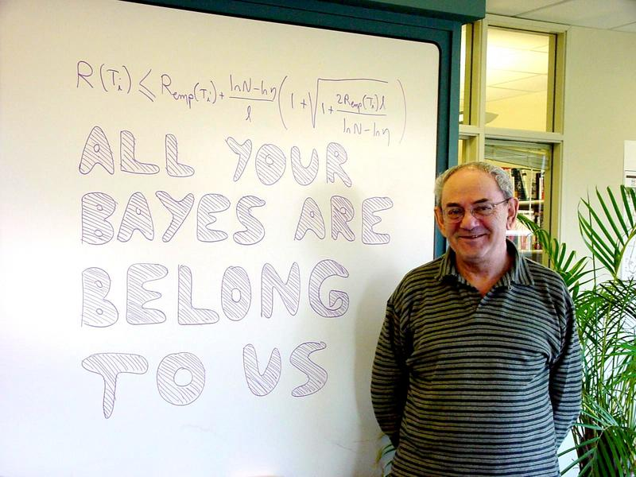
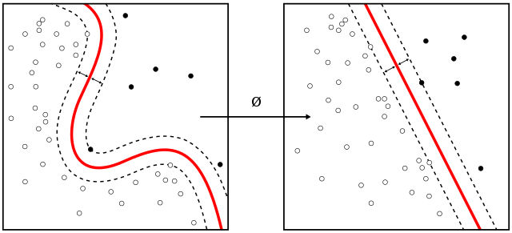

<script src="index_files/htmlwidgets/htmlwidgets.js"></script>
<link href="index_files/datatables-css/datatables-crosstalk.css" rel="stylesheet" />
<script src="index_files/datatables-binding/datatables.js"></script>
<script src="index_files/jquery/jquery-3.6.0.min.js"></script>
<link href="index_files/dt-core/css/jquery.dataTables.min.css" rel="stylesheet" />
<link href="index_files/dt-core/css/jquery.dataTables.extra.css" rel="stylesheet" />
<script src="index_files/dt-core/js/jquery.dataTables.min.js"></script>
<link href="index_files/crosstalk/css/crosstalk.min.css" rel="stylesheet" />
<script src="index_files/crosstalk/js/crosstalk.min.js"></script>

# What are Support Vector Machines (SVM)?

Support vector machines are supervised learning models that analyse data to find patterns useful in classification and regression. They are versatile: they can identify non-linear relationships, work with discrete and continuous data, and are used for two-class classification, multi-class classification as well as regression. They are remarkable for unifying geometric theory, elegant mathematics, and theoretical guarantees with practical solid use cases.

They provide several specific benefits.

1.  With the use of Kernel functions, they are highly effective in higher dimensional spaces.

2.  When the number of dimensions is larger than the number of samples, SVM can still be used. However, one has to be careful with the chosen regularisation parameter ($C$ in this article) and the Kernel function.

3.  Only a subset of training data (called support vector) is used for prediction. Therefore, retaining all the training information in the memory is unnecessary, so the prediction process doesn’t slow.

## History

Vladimir Vapnik and colleagues developed the theory for SVM at AT&T Bell Laboratories[^1] in 1963. They are one of the most robust prediction methods based on a statistical learning framework called **VC Theory** developed by Vapnik and Chervonenkis.

Properties of SVM with soft-margin are examples of **empirical risk minimization (ERM) algorithm** with **hinge loss function**. SVMs belong to a natural class of algorithms for statistical inference, which also happens to produce really good predictions.

**Inference + Prediction = Data Science. What more can you ask?**



> Vapnik showing off his ERM framework, taking a jibe on superiority to Bayesian statistics. (ERM formula at top.)

# How do they work?

Geometrically, **SVM tries to find a linear hyperplane that separates the data into two classes**.

Consider the following example where I’m selecting two species of Iris flowers and plotting their sepal width and sepal length. The colour represents the species.

``` r
library(tidyverse)
theme_set(ggthemes::theme_clean())

p = iris |> 
   filter(Species != "versicolor") |> 
   ggplot(aes(x = Sepal.Length, y = Sepal.Width, colour = Species)) +
   geom_point()
p
```

}}index_files/figure-html/unnamed-chunk-1-1.png" width="672" />

There seems to be a clear separation between the two species. **Can we draw a (straight) line that separates them?**

``` r
p = p +
   geom_segment(aes(x = 4, y = 2, xend = 7, yend = 4.5), 
                colour = 4, lty = 2, alpha = 0.7)
p
```

}}index_files/figure-html/unnamed-chunk-2-1.png" width="672" />

Except for one `setosa` which is misclassified, we got them all right.

However, there are infinitely many other lines possible.

``` r
p = p +
   geom_segment(aes(x = 4.4, y = 2, xend = 6.5, yend = 4.5), 
                colour = 5, lty = 2, alpha = 0.7) +
   geom_segment(aes(x = 5, y = 2, xend = 6.5, yend = 4), 
                colour = 6, lty = 2, alpha = 0.7)
p
```

}}index_files/figure-html/unnamed-chunk-3-1.png" width="672" />

Any many many more.

## Paradox of Choices

Since there are so many choices in deciding the best model, we need to define the problem more rigorously.

### **What would be the “best” hyperplane separating the two classes?**

One way to visualize this problem is to think about how we could maximize the distance between two classes. Therefore, **the** **best partitioning hyperplane would maximize the distance between the two classes**.

Think again of the classification problem we have.[^2]

``` r
iris |> 
   filter(Species != "versicolor") |>
   filter(Sepal.Length > 5) |> 
   ggplot(aes(x = Sepal.Length, y = Sepal.Width, colour = Species)) +
   geom_point()
```

}}index_files/figure-html/unnamed-chunk-4-1.png" width="672" />

## What is a good “margin”?

By visual examination, choose between the three options: **which one is the best separating hyperplane?**

### Option A


### Option B


### Option C


## Mathematically…

The middle line of the margin is `\(w'x + b = 0\)` while the top and bottom lines are `\(w'x + b = -1\)` and `\(w'x + b = 1\)`.

For any unseen point,

$$
f(x) = \begin{cases}
          1 & \text{if} & w'x+b \geq 1 \\
          -1 & \text{if} &w'x + b \leq -1
       \end{cases}
$$

The margin width is `\(\frac{2}{||w||^2}\)`, which has to maximized. This is equivalent to **minimizing** `\(\frac{||w||^2}{2}\)`, subject to the constraints:

$$
f(x) = \begin{cases}
          1 & \text{if} & w'x+b \geq 1 \\
          -1 & \text{if} &w'x + b \leq -1
       \end{cases}
$$

This is a **constrained optimization problem** that can be solved via many methods (numerical, quadratic optimization, etc.).

# What if they’re not separable?

In our dummy example, I removed two points. But that is usually not a good idea. Can you exclude points from your data because they’re hard to classify?[^3]

That’s a blunder for two reasons.

1.  First, **we want to build a model that works for all data points** — including extreme data points. We will not know if a test point is an extreme point.
2.  Second, **how will you decide which points to remove**? If you remove all tough cases, why even use SVM? A simple linear regression can do a reasonably good work forecasting some points.

Let’s take a look at a problem when the classes are not perfectly separable.


This one “blue” point is being misclassified. Can we do something about it?

## Here come slack variables to rescue…

Slack variables ($\xi$) add a **“padding” around the margin, which varies by observation**. For data on the wrong side of the margin, the modified objective function’s value is proportional to its distance from the margin.

**This is called “soft” margin.**

### Optimisation Problem

$$
\min L(w) = \frac{||w||^2}{2} + C\left( \sum_{i = 1}^N \xi_i^k \right)
$$

subject to constraints

$$
f(x_i) = \begin{cases}
          1 & \text{if} & w'x+b \geq 1 - \xi_i \\
          -1 & \text{if} &w'x + b \leq -1 + \xi_i
       \end{cases}.
$$

## Another alternative: Non-linear SVM

What if the data has a non-linear trend, like the example below? A linear hyperplane does not make sense at all in that case.


**We can map our features to a new feature space where they are linearly separable.** Recall that we usually take the natural logarithm of wealth before using them in linear regression. The concept is similar, except that it is very expansive and works for many cases.

## Kernel Functions



We can also create non-linear classifiers by applying “**kernel trick**”. It is a commonly known technique in statistics which **converts lower-dimensional functions to higher-dimensional functions**. Generally, it is easier to spot clear decision boundaries in higher dimensions.

The resulting algorithm is similar, except that a non-linear kernel function replaces every dot product. Then, the algorithm can fit the **maximum-margin hyperplane in a transformed feature space**.

Note that the transformation might be non-linear, and the new space can be high dimensional. The classifier will be a linear hyperplane in the new space but might be non-linear in the original input space.

## Some Common Kernels

### Polynomial Kernel

$$
k(x_i, x_j) = (x_i' x_j + 1)^d,
$$

when `\(d = 1\)`, this is linear kernel; `\(d = 2\)`, this is quadratic kernel.

### Radial Basis Kernel / Gaussian Kernel

$$
k(x_i, x_j) = \exp(-\gamma ||x_i - x_j||^2),
$$

for all `\(\gamma > 0\)`. When `\(\gamma = 1/2\sigma^2\)`, this is known to have a width `\(\sigma\)`. It is also known as Radial Basis Function (RBF).

# Notes on SVM’s Practical Usage

1.  SVM performs best on average and can outperform most other techniques across many important applications.
2.  The effectiveness of SVM in practice depends on (a) the choice of kernel, (b) kernel’s parameters, and (c) soft-margin parameter `\(C\)`.
3.  Gaussian Kernel (or RBF) is a common choice for kernel function. Its `\(\gamma\)` has to be tuned.
4.  Being a statistically-oriented method, the results are stable, reproducible and largely independent of the specific optimisation algorithm.
5.  Being a convex optimisation problem, this leads to the global optimum.
6.  Computational challenge: solving the optimisation problem has quadratic complexity. While this is not too bad, using Kernel spaces increases the number of features exaggerating the problem multifold.
7.  SVM classifier doesn’t provide posterior class probabilities like Logistic regression. It simply classifies the point into a region. Many packages estimate posterior probabilities with cross validation though.

# Case Study: Classifying Type of Animals at a Zoo

In this example, we will try to predict the type of animal given it’s other characteristics using linear SVM, aka vanilla SVM. This is the `zoo` data from `mlbench` package.

Let’s see the data.

``` r
data(Zoo, package = "mlbench")
Zoo = as_tibble(Zoo)
Zoo |>
   DT::datatable()
```

<div id="htmlwidget-1" style="width:100%;height:auto;" class="datatables html-widget"></div>
<script type="application/json" data-for="htmlwidget-1">{"x":{"filter":"none","vertical":false,"data":[["1","2","3","4","5","6","7","8","9","10","11","12","13","14","15","16","17","18","19","20","21","22","23","24","25","26","27","28","29","30","31","32","33","34","35","36","37","38","39","40","41","42","43","44","45","46","47","48","49","50","51","52","53","54","55","56","57","58","59","60","61","62","63","64","65","66","67","68","69","70","71","72","73","74","75","76","77","78","79","80","81","82","83","84","85","86","87","88","89","90","91","92","93","94","95","96","97","98","99","100","101"],[true,true,false,true,true,true,true,false,false,true,true,false,false,false,false,false,false,true,false,false,false,false,true,false,false,false,false,true,true,true,false,true,true,false,false,true,true,false,false,true,true,false,false,false,true,true,false,true,true,true,true,true,false,false,true,true,false,false,false,false,false,false,false,true,true,true,false,true,true,true,true,false,false,false,true,true,false,false,false,false,false,false,false,false,true,false,false,false,false,false,false,false,false,true,true,false,true,true,true,false,false],[false,false,false,false,false,false,false,false,false,false,false,true,false,false,false,false,true,false,false,false,true,true,false,true,false,false,false,false,false,false,false,false,false,true,false,false,false,true,false,false,false,true,false,true,false,false,false,false,false,false,false,false,false,false,false,false,true,true,true,true,false,false,false,false,false,false,false,false,false,false,false,true,false,false,false,false,false,false,true,true,false,false,false,true,false,false,false,true,false,false,false,false,false,false,false,true,false,false,false,false,true],[false,false,true,false,false,false,false,true,true,false,false,true,true,true,true,true,true,false,true,false,true,true,false,true,true,true,true,false,false,false,true,false,false,true,true,false,false,true,true,true,true,true,true,true,false,false,true,false,false,false,false,true,true,true,false,false,true,true,true,true,true,true,true,true,false,false,false,false,false,false,false,true,false,true,false,false,false,true,true,true,true,true,true,true,false,true,true,true,true,true,true,true,true,false,false,true,false,true,false,true,true],[true,true,false,true,true,true,true,false,false,true,true,false,false,false,false,false,false,true,false,true,false,false,true,false,false,false,false,true,true,true,false,true,true,false,false,true,true,false,false,false,false,false,false,false,true,true,false,true,true,true,true,false,false,false,true,true,false,false,false,false,false,false,false,true,true,true,true,true,true,true,true,false,false,false,true,true,false,false,false,false,false,false,false,false,true,false,false,false,false,false,false,false,false,true,true,false,true,false,true,false,false],[false,false,false,false,false,false,false,false,false,false,false,true,false,false,false,false,true,false,false,false,true,true,false,true,false,false,false,true,false,false,true,false,false,true,false,false,false,true,false,true,true,false,true,true,false,false,false,false,false,false,false,true,false,false,false,false,false,true,false,true,false,false,false,false,false,false,false,false,false,false,false,false,false,false,false,false,false,false,true,true,false,false,false,true,false,false,false,true,false,false,false,false,false,true,false,true,false,true,false,false,true],[false,false,true,false,false,false,false,true,true,false,false,false,true,false,true,true,false,false,true,true,false,true,false,false,false,true,true,false,false,false,false,false,false,true,true,false,false,false,true,false,false,false,false,false,false,false,true,false,true,false,false,false,true,true,false,false,false,false,true,false,true,true,false,true,false,false,true,false,false,false,false,false,false,true,true,true,true,true,true,true,false,false,true,false,false,true,true,true,false,true,false,false,true,false,false,false,false,false,false,false,false],[true,false,true,true,true,false,false,false,true,false,true,false,true,true,true,true,true,false,true,true,false,false,false,false,false,true,true,false,false,true,false,false,false,true,false,false,false,true,true,false,false,true,true,false,true,true,true,true,true,true,true,false,true,true,true,false,false,false,true,false,true,true,true,true,true,false,true,true,true,true,false,true,true,false,true,true,true,true,true,true,true,false,false,false,false,true,true,false,false,false,false,true,true,false,false,true,false,false,true,false,false],[true,true,true,true,true,true,true,true,true,true,true,false,true,false,false,false,false,true,true,true,false,false,true,false,false,true,true,true,true,true,false,true,true,false,true,true,true,false,true,false,false,false,false,false,true,true,false,true,true,true,true,false,true,false,true,true,false,false,false,false,true,true,true,false,true,true,true,true,true,true,true,false,false,true,true,true,true,false,false,false,true,false,true,false,true,false,true,false,false,true,false,true,true,true,true,false,true,false,true,false,false],[true,true,true,true,true,true,true,true,true,true,true,true,true,false,false,false,true,true,true,true,true,true,true,true,false,true,true,true,true,true,false,true,true,true,true,true,true,true,true,false,false,true,false,true,true,true,false,true,true,true,true,false,true,false,true,true,true,true,true,true,true,true,true,true,true,true,true,true,true,true,true,true,false,true,true,true,true,false,true,true,true,false,true,true,true,false,true,true,false,true,true,true,true,true,true,true,true,false,true,false,true],[true,true,false,true,true,true,true,false,false,true,true,true,false,false,false,false,true,true,false,true,true,true,true,true,true,true,true,true,true,true,true,true,true,true,false,true,true,true,false,true,true,true,true,true,true,true,false,true,true,true,true,true,true,false,true,true,true,true,true,true,false,false,true,true,true,true,true,true,true,true,true,true,true,false,true,true,false,false,true,true,true,true,false,true,true,false,false,true,true,true,true,true,false,true,true,true,true,true,true,true,true],[false,false,false,false,false,false,false,false,false,false,false,false,false,false,false,false,false,false,false,false,false,false,false,false,false,false,true,false,false,false,false,false,false,false,false,false,false,false,false,true,false,false,false,false,false,false,false,false,false,false,false,false,false,false,false,false,false,false,false,false,false,false,true,false,false,false,false,false,false,false,false,false,true,false,false,false,true,true,false,false,false,false,false,false,false,false,true,false,false,false,false,false,false,false,false,false,false,true,false,false,false],[false,false,true,false,false,false,false,true,true,false,false,false,true,false,false,false,false,false,true,true,false,false,false,false,false,false,false,false,false,false,false,false,false,false,true,false,false,false,true,false,false,false,false,false,false,false,false,false,false,false,false,false,false,false,false,false,false,false,false,false,true,true,false,false,false,false,true,false,false,false,false,false,false,true,true,true,false,false,false,false,false,false,true,false,false,false,true,false,false,false,false,false,true,false,false,false,false,false,false,false,false],[4,4,0,4,4,4,4,0,0,4,4,2,0,0,4,6,2,4,0,0,2,2,4,2,6,4,4,2,4,2,6,4,2,2,0,4,4,2,0,6,6,2,6,2,4,4,6,4,4,4,4,6,4,8,4,4,2,2,2,2,0,0,0,4,4,4,0,4,4,4,4,2,8,0,0,2,0,0,2,2,0,0,0,2,2,5,0,2,6,4,4,4,0,2,4,2,2,6,4,0,2],[false,true,true,false,true,true,true,true,true,false,true,true,true,false,false,false,true,true,true,true,true,true,true,true,false,false,false,true,true,false,false,true,false,true,true,true,true,true,true,false,false,true,false,true,true,true,false,true,true,true,true,false,true,false,true,true,true,true,true,true,true,true,true,true,true,true,true,true,true,true,true,true,true,true,false,true,true,false,true,true,true,false,true,true,true,false,true,true,false,false,true,true,true,true,true,true,true,false,true,false,true],[false,false,false,false,false,false,true,true,false,true,false,true,false,false,false,false,false,false,false,false,true,false,false,false,false,false,false,false,false,true,false,true,false,false,false,true,false,false,false,true,false,false,false,false,false,false,false,false,false,false,false,false,false,false,false,false,false,true,false,false,false,false,false,false,false,true,false,false,true,false,true,false,false,false,false,false,false,false,false,false,false,false,false,false,false,false,false,false,false,false,false,false,false,false,false,false,false,false,false,false,false],[true,true,false,true,true,true,true,false,false,false,true,false,false,false,false,false,false,true,true,true,false,false,true,true,false,false,false,false,true,true,false,true,true,false,false,false,false,false,false,false,false,false,false,false,true,true,false,true,true,false,true,false,false,true,false,true,true,false,true,false,true,false,false,true,true,true,true,true,true,true,true,true,false,false,true,true,false,false,false,false,false,false,false,false,false,false,true,true,false,false,true,false,true,false,false,true,true,false,true,false,false],["mammal","mammal","fish","mammal","mammal","mammal","mammal","fish","fish","mammal","mammal","bird","fish","mollusc.et.al","mollusc.et.al","mollusc.et.al","bird","mammal","fish","mammal","bird","bird","mammal","bird","insect","amphibian","amphibian","mammal","mammal","mammal","insect","mammal","mammal","bird","fish","mammal","mammal","bird","fish","insect","insect","bird","insect","bird","mammal","mammal","mollusc.et.al","mammal","mammal","mammal","mammal","insect","amphibian","mollusc.et.al","mammal","mammal","bird","bird","bird","bird","fish","fish","reptile","mammal","mammal","mammal","mammal","mammal","mammal","mammal","mammal","bird","mollusc.et.al","fish","mammal","mammal","reptile","mollusc.et.al","bird","bird","reptile","mollusc.et.al","fish","bird","mammal","mollusc.et.al","fish","bird","insect","amphibian","reptile","reptile","fish","mammal","mammal","bird","mammal","insect","mammal","mollusc.et.al","bird"]],"container":"<table class=\"display\">\n  <thead>\n    <tr>\n      <th> <\/th>\n      <th>hair<\/th>\n      <th>feathers<\/th>\n      <th>eggs<\/th>\n      <th>milk<\/th>\n      <th>airborne<\/th>\n      <th>aquatic<\/th>\n      <th>predator<\/th>\n      <th>toothed<\/th>\n      <th>backbone<\/th>\n      <th>breathes<\/th>\n      <th>venomous<\/th>\n      <th>fins<\/th>\n      <th>legs<\/th>\n      <th>tail<\/th>\n      <th>domestic<\/th>\n      <th>catsize<\/th>\n      <th>type<\/th>\n    <\/tr>\n  <\/thead>\n<\/table>","options":{"columnDefs":[{"className":"dt-right","targets":13},{"orderable":false,"targets":0}],"order":[],"autoWidth":false,"orderClasses":false}},"evals":[],"jsHooks":[]}</script>

## Correlation

Let’s do some descriptive statistics and explore how the data looks. How do different types of animals vary? Can we see a quick [correlation](https://stackoverflow.com/a/61482149/8057777)?

``` r
library(ggcorrplot)
model.matrix(~0+., data = Zoo) |>  
  cor(use="pairwise.complete.obs") |> 
  ggcorrplot(show.diag = F, type="lower", lab=TRUE, lab_size=2)
```

}}index_files/figure-html/unnamed-chunk-6-1.png" width="672" />

This can tell us a lot of interesting insights!

## Modelling

### Fitting Model

But our time is limited, so jumping to SVM. Recall that `train()` takes formula as the first input, data as the second input, method as the third input and other training controls.

``` r
library(caret)
svmFit = train(
   type ~., 
   data = Zoo, 
   method = "svmLinear",
   trControl = trainControl(method = "cv", number = 10)
)
svmFit
```

    ## Support Vector Machines with Linear Kernel 
    ## 
    ## 101 samples
    ##  16 predictor
    ##   7 classes: 'mammal', 'bird', 'reptile', 'fish', 'amphibian', 'insect', 'mollusc.et.al' 
    ## 
    ## No pre-processing
    ## Resampling: Cross-Validated (10 fold) 
    ## Summary of sample sizes: 91, 90, 92, 89, 91, 92, ... 
    ## Resampling results:
    ## 
    ##   Accuracy  Kappa    
    ##   0.97      0.9608681
    ## 
    ## Tuning parameter 'C' was held constant at a value of 1

Let’s see details about the final model.

``` r
# storing final model
svmFinal = svmFit$finalModel
svmFinal
```

    ## Support Vector Machine object of class "ksvm" 
    ## 
    ## SV type: C-svc  (classification) 
    ##  parameter : cost C = 1 
    ## 
    ## Linear (vanilla) kernel function. 
    ## 
    ## Number of Support Vectors : 47 
    ## 
    ## Objective Function Value : -0.1448 -0.218 -0.1484 -0.1754 -0.0936 -0.1033 -0.297 -0.0819 -0.1556 -0.0907 -0.1135 -0.182 -0.5763 -0.13 -0.1833 -0.118 -0.0474 -0.0823 -0.1236 -0.1481 -0.5666 
    ## Training error : 0

## Predictions

I will use `predict()` to calculate the predictions. I’m predicting on training data, which is not advisable. But it shows how the SVM function works.

``` r
# creating predictions
pred = predict(svmFit, newdata = Zoo)
pred
```

    ##   [1] mammal        mammal        fish          mammal        mammal       
    ##   [6] mammal        mammal        fish          fish          mammal       
    ##  [11] mammal        bird          fish          mollusc.et.al mollusc.et.al
    ##  [16] mollusc.et.al bird          mammal        fish          mammal       
    ##  [21] bird          bird          mammal        bird          insect       
    ##  [26] amphibian     amphibian     mammal        mammal        mammal       
    ##  [31] insect        mammal        mammal        bird          fish         
    ##  [36] mammal        mammal        bird          fish          insect       
    ##  [41] insect        bird          insect        bird          mammal       
    ##  [46] mammal        mollusc.et.al mammal        mammal        mammal       
    ##  [51] mammal        insect        amphibian     mollusc.et.al mammal       
    ##  [56] mammal        bird          bird          bird          bird         
    ##  [61] fish          fish          reptile       mammal        mammal       
    ##  [66] mammal        mammal        mammal        mammal        mammal       
    ##  [71] mammal        bird          mollusc.et.al fish          mammal       
    ##  [76] mammal        reptile       mollusc.et.al bird          bird         
    ##  [81] reptile       mollusc.et.al fish          bird          mammal       
    ##  [86] mollusc.et.al fish          bird          insect        amphibian    
    ##  [91] reptile       reptile       fish          mammal        mammal       
    ##  [96] bird          mammal        insect        mammal        mollusc.et.al
    ## [101] bird         
    ## Levels: mammal bird reptile fish amphibian insect mollusc.et.al

### Confusion Matrix

``` r
# confusion matrix
table(Zoo$type, pred)
```

    ##                pred
    ##                 mammal bird reptile fish amphibian insect mollusc.et.al
    ##   mammal            41    0       0    0         0      0             0
    ##   bird               0   20       0    0         0      0             0
    ##   reptile            0    0       5    0         0      0             0
    ##   fish               0    0       0   13         0      0             0
    ##   amphibian          0    0       0    0         4      0             0
    ##   insect             0    0       0    0         0      8             0
    ##   mollusc.et.al      0    0       0    0         0      0            10

### Accuracy

The model has a 100% accuracy on the training data.

``` r
# prediction accuracy
sum(Zoo$type==pred)/nrow(Zoo)
```

    ## [1] 1

------------------------------------------------------------------------

#### Post-notes

This article was originally created for my guest lecture in Prof Charles Liu’s [*BZAN 542: Data Mining Methods for Business Applications*](https://github.com/harshvardhaniimi/bzan-542) class. The lecture received positive response and interesting questions, which improved this document.

I would’ve preferred using [Tidymodels’ SVM](https://www.tidymodels.org/learn/work/tune-svm/) instead of caret. But since the entire class was designed with caret, I’ve followed the convention.

[^1]: Now called Nokia Labs.

[^2]: You would notice that I’ve removed two points, just for simplicity.

[^3]: Try saying “these points are hard to classify so I’ll ignore them” to your client. **Don’t** — unless you want to lose your job.
